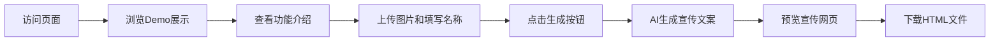

## 1. 产品概述

学校宣传网页自定义工具，帮助学校快速生成精美的宣传网页。用户只需上传校徽、横版/竖版学校图片并填写学校名称，系统即可通过AI自动生成宣传文案并生成完整的HTML宣传网页。

- 主要用途：快速制作学校宣传网页，降低设计和开发门槛
- 目标用户：学校宣传部门老师、教育机构运营人员
- 产品价值：几分钟内从零生成专业级学校宣传网页

## 2. 核心功能

### 2.1 用户角色
| 角色 | 注册方式 | 核心权限 |
|------|----------|----------|
| 普通用户 | 无需注册，直接使用 | 上传图片、填写学校名称、生成并下载宣传网页 |

### 2.2 功能模块
1. **宣传网页Demo展示区**：展示一个精美的学校宣传网页示例，让用户直观了解最终效果
2. **功能介绍区**：展示工具的核心功能特点
3. **自定义表单区**：上传校徽、横版图片、竖版图片，填写学校名称
4. **AI内容生成区**：基于学校名称通过AI生成宣传文案（含提示词模板配置）
5. **预览与导出区**：实时预览生成的宣传网页，支持导出为HTML文件

### 2.3 页面详情
| 页面名称 | 模块名称 | 功能描述 |
|-----------|-------------|---------------------|
| 首页 | Demo展示区 | 全屏展示学校宣传网页Demo，可滚动浏览，视觉冲击力强 |
| 首页 | 功能特点区 | 3-4个功能卡片展示核心能力 |
| 首页 | 表单上传区 | 图片上传（校徽、横版、竖版）+ 学校名称输入 + 生成按钮 |
| 首页 | 预览弹窗 | 生成后展示预览效果，提供下载HTML按钮 |

## 3. 核心流程

用户打开页面 → 浏览Demo展示和功能介绍 → 滚动到下方上传区域 → 上传校徽/横版图片/竖版图片 → 填写学校名称 → 点击生成按钮 → AI生成宣传文案 → 预览生成的网页 → 下载HTML文件

## 4. 用户界面设计

### 4.1 设计风格
- 主色调：深蓝色（学术、专业、可信赖），搭配金色点缀（庄重、荣誉）
- 辅助色：白色、浅灰背景
- 按钮风格：圆角矩形，悬停有微动画效果
- 字体：中文使用「思源宋体」或「Noto Serif SC」作为标题字体（学院风），正文使用清晰的无衬线字体
- 布局风格：单页滚动式，分区块设计，有明显的视觉分隔
- 图标风格：简约线性图标

### 4.2 页面设计概述
| 页面名称 | 模块名称 | UI元素 |
|-----------|-------------|-------------|
| 首页 | Demo展示区 | 全屏高度，网页设备框展示，渐变背景，滚动提示 |
| 首页 | 功能特点区 | 卡片式布局，图标+标题+描述，三列或两列 |
| 首页 | 表单上传区 | 拖拽上传区域，文件预览，输入框，主按钮 |
| 首页 | 预览弹窗 | 模态框，iframe预览，下载按钮，关闭按钮 |

### 4.3 响应式
- 桌面端优先设计
- 平板端：功能卡片两列布局
- 移动端：单列布局，上传区域适配手机屏幕

### 4.4 动画与交互
- 页面滚动时各区块渐入动画
- 上传区域拖拽悬停效果
- 生成按钮loading状态
- 弹窗淡入淡出效果
