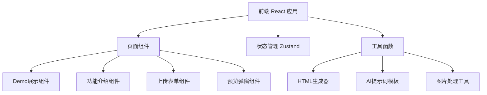

## 1. 架构设计



## 2. 技术描述

- 前端：React@18 + TypeScript + Vite + Tailwind CSS@3
- 状态管理：Zustand
- 图标库：lucide-react
- 后端：无需后端，纯前端实现
- AI内容生成：使用预设提示词模板 + 模拟生成（前端演示），预留API接入能力

## 3. 路由定义

| 路由 | 用途 |
|-------|---------|
| / | 首页，包含所有功能模块 |

## 4. 核心数据结构

### 4.1 学校信息数据结构

```typescript
interface SchoolData {
  name: string;
  logo: string; // base64 or URL
  horizontalImage: string; // base64 or URL
  verticalImage: string; // base64 or URL
}
```

### 4.2 宣传文案数据结构

```typescript
interface PromotionContent {
  slogan: string; // 标语
  description: string; // 学校简介
  features: string[]; // 办学特色
  history: string; // 历史沿革
  contact: {
    address: string;
    phone: string;
    email: string;
  };
}
```

### 4.3 生成的网页配置

```typescript
interface GeneratedPage {
  school: SchoolData;
  content: PromotionContent;
  html: string;
}
```

## 5. 核心模块说明

### 5.1 AI提示词模板模块
- 位置：`src/utils/promptTemplate.ts`
- 功能：根据学校名称生成完整的AI提示词
- 输出格式：JSON格式的宣传文案结构

### 5.2 HTML生成器模块
- 位置：`src/utils/htmlGenerator.ts`
- 功能：根据学校信息和宣传文案生成完整的HTML文件
- 特点：内联所有CSS和图片（base64），确保单文件可用

### 5.3 图片上传处理模块
- 位置：`src/utils/imageUtils.ts`
- 功能：处理图片上传、预览、转换为base64

## 6. 组件结构

```
src/
  components/
    DemoSection/       # Demo展示区
    FeaturesSection/   # 功能介绍区
    UploadForm/        # 上传表单区
    PreviewModal/      # 预览弹窗
  pages/
    Home.tsx           # 首页
  utils/
    promptTemplate.ts  # AI提示词模板
    htmlGenerator.ts   # HTML生成器
    imageUtils.ts      # 图片处理工具
  store/
    useSchoolStore.ts  # 状态管理
  App.tsx
  main.tsx
```
